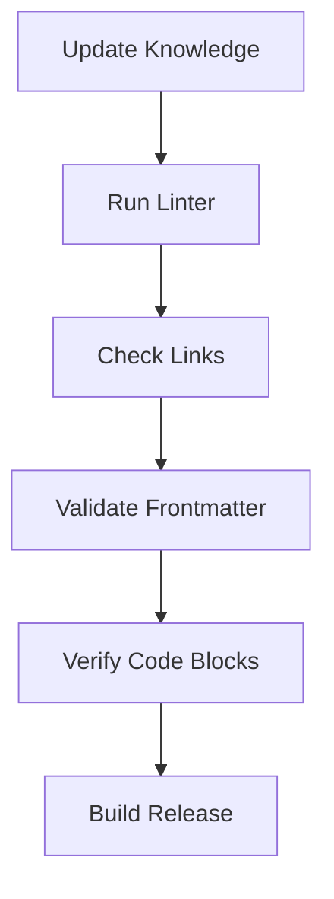

# Design: Knowledge Base Maintenance Strategy

## Context
The PSADT knowledge base is a critical component of Packager-MCP, providing the "brain" for package generation and troubleshooting. Unlike code, knowledge requires manual curation and regular updates to remain accurate.

The project maintains a `ReferenceKnowledge/` folder containing authoritative source material:
- **V3DOCS.md** (~486KB) - Complete PSADT v3 documentation
- **V4DOCS.md** (~94KB) - Complete PSADT v4 documentation  
- **Examples/** - Real-world PSADT scripts (VLC, WinRAR, WinSCP, etc.)

This reference material serves as the **source of truth** for updating the curated `src/knowledge/` files.

**Stakeholders**: Maintainers, Contributors, Users relying on up-to-date guidance
**Constraints**: Must maintain offline capability (no live fetching)

## Goals / Non-Goals
**Goals**:
- Use `ReferenceKnowledge/` as the authoritative source for PSADT documentation
- Transform reference docs into curated, focused `src/knowledge/` content
- Ensure knowledge base reflects the supported PSADT version (currently v4)
- Track changes to knowledge explicitly
- Validate structural integrity of knowledge files
- Provide clear path for updates when PSADT/Intune evolves

**Non-Goals**:
- Automated content scraping from external sources (too fragile/risky)
- Real-time updates (quarterly cadence is sufficient)
- Direct exposure of raw reference docs (too large, not curated)

## Decisions

### Decision 1: Version-Locked Knowledge
- **Why**: Ensures users know exactly what version of PSADT the guidance targets. Avoids confusion when upstream versions diverge.
- **Pattern**: `knowledge/VERSION` file tracks the target PSADT version. Each markdown file includes metadata about its target version.

### Decision 2: Hybrid Maintenance Model
- **Why**: Combines structured scheduled reviews with ad-hoc updates.
- **Pattern**: 
  - **Quarterly Reviews**: Comprehensive check of all docs against upstream.
  - **Ad-hoc Updates**: Immediate fixes for critical errors or new discoveries.

### Decision 3: Automated Validation
- **Why**: Prevents structural regression (broken links, invalid frontmatter).
- **Pattern**: CI pipeline tests for markdown syntax, link validity, and required metadata.

## Architecture

### Two-Tier Knowledge Structure

```
ReferenceKnowledge/              # SOURCE OF TRUTH (raw, complete)
├── V3DOCS.md                    # Full PSADT v3 documentation
├── V4DOCS.md                    # Full PSADT v4 documentation
└── Examples/                    # Real-world script examples
    ├── VLC/
    ├── WinRAR/
    ├── WinSCP/
    └── ...

src/knowledge/                   # CURATED OUTPUT (focused, MCP-ready)
├── VERSION                      # Contains "4.0.3"
├── CHANGELOG.md                 # Tracks knowledge updates
├── CONTRIBUTING.md              # Guide for updating knowledge
├── psadt/
│   ├── overview.md              # Extracted from V4DOCS.md
│   ├── functions.md             # Extracted from V4DOCS.md
│   ├── variables.md             # Extracted from V4DOCS.md
│   ├── migration.md             # Derived from V3DOCS.md + V4DOCS.md
│   └── best-practices.md        # Curated from Examples/
├── installers/
├── patterns/
└── reference/
```

### Update Workflow

```
┌─────────────────────────────────────────────────────────────┐
│              ReferenceKnowledge/ (Source)                    │
│  ┌──────────────┐  ┌──────────────┐  ┌──────────────┐      │
│  │  V4DOCS.md   │  │  V3DOCS.md   │  │  Examples/   │      │
│  │  (94KB)      │  │  (486KB)     │  │  (scripts)   │      │
│  └──────┬───────┘  └──────┬───────┘  └──────┬───────┘      │
└─────────┼─────────────────┼─────────────────┼───────────────┘
          │                 │                 │
          ▼                 ▼                 ▼
┌─────────────────────────────────────────────────────────────┐
│              Manual Curation Process                         │
│  1. Extract relevant sections from V4DOCS.md                │
│  2. Compare v3→v4 changes for migration.md                  │
│  3. Derive patterns from Examples/                          │
│  4. Focus content for MCP resource consumption              │
└─────────────────────────────────────────────────────────────┘
          │
          ▼
┌─────────────────────────────────────────────────────────────┐
│              src/knowledge/ (Curated Output)                 │
│  Focused, structured content exposed via MCP Resources      │
└─────────────────────────────────────────────────────────────┘
```

### Version Metadata Structure

Every knowledge file MUST have YAML frontmatter:

```markdown
---
title: "MSI Packaging Guide"
id: "kb-installers-msi"
psadt_target: "4.0.x"
last_updated: "2024-12-07"
verified_by: "maintainer"
source_ref: "ReferenceKnowledge/V4DOCS.md#section-name"
tags: ["msi", "installers", "guide"]
---
```

### Validation Pipeline



## Risks / Trade-offs

| Risk | Impact | Mitigation |
|------|--------|------------|
| Knowledge drift | High | Quarterly reviews, strict versioning |
| Inaccurate examples | Medium | Automated syntax checking of code blocks |
| Maintenance burden | Medium | Community contribution guide, clear scope |

## Migration Plan
N/A - Process implementation.
